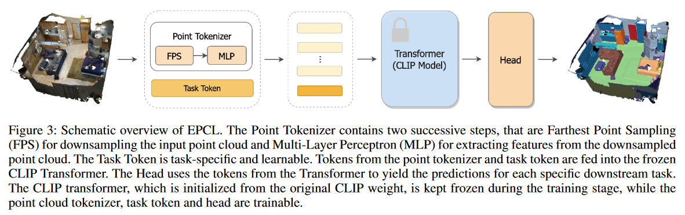

# EPCL

## EPCL: Frozen CLIP Transformer is An Efficient Point Cloud Encoder, [AAAI 2024](https://arxiv.org/abs/2212.04098)

The pretrain-finetune paradigm has achieved great success in NLP and 2D image fields because of the high-quality representation ability and transferability of their pretrained models. However, pretraining such a strong model is difficult in the 3D point cloud field due to the limited amount of point cloud sequences. This paper introduces Efficient Point Cloud Learning (EPCL), an effective and efficient point cloud learner for directly training high-quality point cloud models with a frozen CLIP transformer. Our EPCL connects the 2D and 3D modalities by semantically aligning the image features and point cloud features without paired 2D-3D data. Specifically, the input point cloud is divided into a series of local patches, which are converted to token embeddings by the designed point cloud tokenizer. These token embeddings are concatenated with a task token and fed into the frozen CLIP transformer to learn point cloud representation. The intuition is that the proposed point cloud tokenizer projects the input point cloud into a unified token space that is similar to the 2D images. 


## Getting Started
In this repository, we have implemented our methods on four tasks: classification, detection, indoor segmentation and outdoor segmentation. If you want to run the corresponding tasks, please refer to the README.md in each task for details:
- [classification](classification/README.md)
- [detection](detection/README.md)
- [indoor-segmentation](indoor_segmentation/README.md)
- [outdoor-segmentation](outdoor_segmentation/README.md)

## Citing our work

Please cite the following papers if you use our code:

```latex
@article{huangepcl,
  title={EPCL: Frozen CLIP Transformer is An Efficient Point Cloud Encoder},
  author={Xiaoshui Huang, Zhou Huang, Sheng Li, Wentao Qu, Tong He, Yuenan Hou, Yifan Zuo, Wanli Ouyang},
  journal={AAAI},
  year={2024}
}
```


## Acknowledgement
The frozen transformer encoder used in all tasks comes from [CLIP](https://github.com/openai/CLIP). 

Part of our implementation uses code from repositories below:
- [Point-MAE](https://github.com/Pang-Yatian/Point-MAE)
- [CAGroup3D](https://github.com/Haiyang-W/CAGroup3D)
- [PointMixer](https://github.com/LifeBeyondExpectations/ECCV22-PointMixer)
- [OpenPCSeg](https://github.com/PJLab-ADG/OpenPCSeg)
- [Pointnet2_PyTorch](https://github.com/erikwijmans/Pointnet2_PyTorch)
- [P-tuning-v2](https://github.com/THUDM/P-tuning-v2)

Thank the authors for their great work!